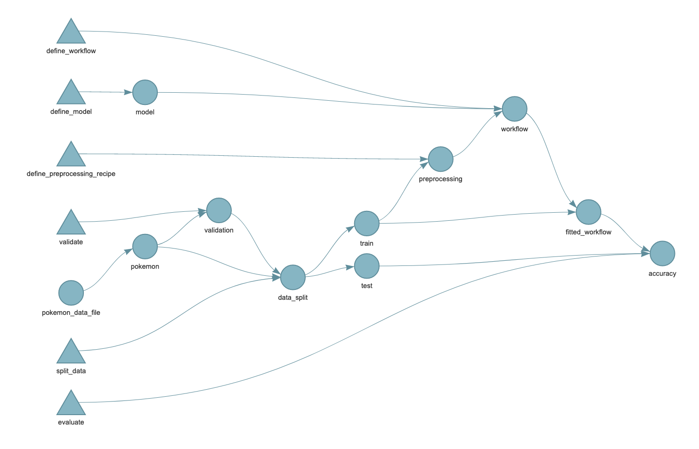

```{r setup, include=FALSE}
library(kableExtra)
options(htmltools.dir.version = FALSE)
knitr::opts_chunk$set(echo = TRUE)
print_table <- function(x) {
  kable_styling(
    knitr::kable(x, "html"),
    full_width = FALSE
  )
}

library(ggplot2)
bigger_text <- theme(
  text = element_text(size = 20),
  legend.position = "top"
)
theme_no_y_lab <- theme(
  text = element_text(size = 20),
  axis.text.y = element_blank(),
  axis.ticks.y = element_blank(),
  legend.position = "top"
)
```

class: left, top

# Question

Pokémon have one or two _types_: fire, steel, psychic, etc.

--

Pokémon have _stats_ --- attributes that describe their strengths and weaknesses.

--

From a Pokémon's stats or other features, can we determine its type?

---
class: left, top

# Data load

```{r libraries, message=FALSE, warning=FALSE}
library(tidyverse) # for manipulating data
library(tidymodels) # for modelling
```

```{r load-data, message=FALSE, warning=FALSE}
pokemon <- read_csv("data/pokemon.csv") %>% 
  mutate(
    type1 = as.factor(type1),
    type2 = as.factor(type2),
    legendary = as.logical(legendary)
  )

pokemon %>% colnames
```

---
class: left, top

# What do you notice about this data?

```{r what-do-you-notice-1, echo=FALSE}
pokemon %>% select(number:total) %>% head() %>% print_table()
```

---
class: left, top

# What do you notice about this data?

```{r what-do-you-notice-2, echo=FALSE}
pokemon %>% select(number:total) %>% head() %>% print_table() %>%
row_spec(4, bold = FALSE, color = "white", background = "red")
```

---
class: left, top

# What do you notice about this data?

```{r what-do-you-notice-3, echo=FALSE}
pokemon %>% select(number:total) %>% head() %>% print_table() %>%
row_spec(5, bold = FALSE, color = "white", background = "red")
```

---
class: left, top

# What do you notice about this data?

```{r what-do-you-notice-4, echo=FALSE}
pokemon %>% select(number:total) %>% head() %>% print_table() %>%
column_spec(11, bold = FALSE, color = "white", background = "red")
```

---
class: left, top

# Data assertions matter!

```{r data-assertions, message=FALSE, warning=FALSE}
validate_pokemon <- function(pokemon_data) {
  total_mismatch <- with(
    pokemon_data, 
    total != hp + atk + def + sp_atk + sp_def + spd
  )
  
  important_columns <- pokemon_data %>% select(type1, hp:atk)
  
  !any(total_mismatch) && !any(is.na(important_columns))
}

validate_pokemon(pokemon)
```

---
class: left, top

# Graph your data. Always.

.pull-left[
```{r plot-legendary-density, eval=FALSE}
pokemon %>% 
  ggplot(
    aes(
      x = total,
      color = legendary
    )
  ) +
  geom_density(size = 1) +
  xlab("Total stats") +
  theme_no_y_lab
```
]

.pull-right[
```{r plot-legendary-density-out, ref.label = "plot-legendary-density", echo = FALSE, message = FALSE, warning = FALSE, fig.width = 6, fig.height = 8}
```
]

---
class: left, top

# Graph your data. Always.

.pull-left[
```{r plot-fire-fighting, eval=FALSE}
pokemon %>% 
  filter(
    type1 %in% c(
      "Fire", "Fighting"
    )
  ) %>% 
  ggplot(aes(
      x = atk,
      y = sp_atk,
      color = type1
  )) +
  geom_point(size = 2) + 
  scale_color_manual(
    values = c(
      "Fire" = "#F8766D",
      "Fighting" = "#00BFC4"
    )
  ) +
  bigger_text
```
]

.pull-right[
```{r plot-fire-fighting-out, ref.label = "plot-fire-fighting", echo = FALSE, message = FALSE, warning = FALSE, fig.width = 6, fig.height = 8}
```
]

---
class: left, top

# What do we know?

* Pokémon have one or two types --- the first type is never missing
* None of the stats are missing
* `total` stats is a good measure of a Pokémon's strength
* There's some relationship between type and stats

--

Can we predict a Pokémon's (first) type from its stats?

---
class: left, top

# Let's train a model!

**Before** we start, what's the _target metric_?

--

Keep it simple! What percentage of our type predictions are correct?

--

(In a real situation, we would have other concerns)

---
class: left, top

# Let's train a model!

**Before** we start, what counts as _good enough_?

--

```{r include = FALSE}
water_prop <- pokemon %>%
  filter(type1 == "Water") %>%
  nrow() %>% 
  `/`(nrow(pokemon))
```

The most common type is _water_, at `r scales::percent(water_prop)` of Pokémon. Let's beat that.

---
class: left, top

# Let's train a model!

```{r pokemon_model, message=FALSE, warning=FALSE}
pokemon_model <- rand_forest(
    trees = 200,
    mtry = 3
  ) %>%
  set_engine("ranger") %>% 
  set_mode("classification")

pokemon_model
```

---
class: left, top

# A simple train/test split

```{r train-test-simple}
set.seed(12345)
pokemon_split <- initial_split(pokemon, strata = "type1", prop = 0.7)
pokemon_train <- training(pokemon_split)
pokemon_test <- testing(pokemon_split)

nrow(pokemon_train)

nrow(pokemon_test)
```

---
class: left, top

# First attempt

```{r first-model-fit, warning = FALSE}
fitted_pokemon_model <- pokemon_model %>% fit(
  type1 ~ hp + atk + def + sp_atk + sp_def + spd,
  data = pokemon_train
)

pokemon_test %>% 
  mutate(
    predicted_type1 = predict(
      fitted_pokemon_model,
      pokemon_test
    )$.pred_class
  ) %>%
  accuracy(type1, predicted_type1)
```

--

Hey that's not so bad?

---
class: left, top

# A grouped split

```{r train-test-grouped}
set.seed(12345)

train_families <- pokemon %>% distinct(family) %>% 
  sample_frac(0.7) %>% pull(family)

pokemon_train <- pokemon %>% filter(family %in% train_families)
pokemon_test <- pokemon %>% filter(!(family %in% train_families))

nrow(pokemon_train)

nrow(pokemon_test)
```

---
class: left, top

# Second attempt

```{r second-model-fit, warning = FALSE}
fitted_pokemon_model <- pokemon_model %>% fit(
  type1 ~ hp + atk + def + sp_atk + sp_def + spd,
  data = pokemon_train
)

pokemon_test %>% 
  mutate(
    predicted_type1 = predict(
      fitted_pokemon_model,
      pokemon_test
    )$.pred_class
  ) %>%
  accuracy(type1, predicted_type1)
```

--

Not so good

---
class: left, middle

# Visualising the results

.pull-left[
```{r attempt-1-confusion-matrix, eval=FALSE}
pokemon_test %>% 
  mutate(
    predicted = predict(
      fitted_pokemon_model,
      pokemon_test
      )$.pred_class
  ) %>% 
  conf_mat(type1, predicted) %>% 
  autoplot(type = "heatmap") + 
  theme(
    axis.text.x = element_text(
      angle = 90,
      vjust = 0.5,
      hjust = 1
    )
  )
```
]

.pull-right[
```{r attempt-2-confusion-matrix-out, ref.label = "attempt-1-confusion-matrix", echo = FALSE, message = FALSE, warning = FALSE, fig.width = 6, fig.height = 8}
```
]

---
class: left, middle

# Visualising the results

```{r attempt-1-confusion-matrix-out-repeat, ref.label = "attempt-1-confusion-matrix", echo = FALSE, message = FALSE, warning = FALSE, fig.width = 12, fig.height = 8}
```

---
class: left, middle

# Don't accept a metric at face value

Observations:

* Some types are rare (_flying_ has only 6 rows!)
* Lots of mispredictions as _water_ and _normal_ due to data imbalance
* There's _something_ going right here (bug, psychich)

---
class: left, top

# A little bit of feature engineering

.pull-left[
```{r plot-bug-dragon, eval=FALSE}
pokemon_train %>% 
  filter(
    type1 %in% c(
      "Bug", "Dragon"
    )
  ) %>% 
  ggplot(aes(
      x = atk,
      y = sp_atk,
      color = type1
  )) +
  geom_point(size = 2) + 
  scale_color_manual(
    values = c(
      "Dragon" = "#C77CFF",
      "Bug" = "#7CAE00"
    )
  ) +
  bigger_text
```
]

.pull-right[
```{r plot-bug-dragon-out, ref.label = "plot-bug-dragon", echo = FALSE, message = FALSE, warning = FALSE, fig.width = 6, fig.height = 8}
```
]

---
class: left, top

# A little bit of feature engineering

```{r pokemon-scaled}
pokemon_train_scaled <- pokemon_train %>% 
  mutate(
    across(hp:spd, function(x) x / total)
  )
```

---
class: left, top

# A little bit of feature engineering

.pull-left[
```{r plot-bug-dragon-scaled, eval=FALSE}
pokemon_train_scaled %>% 
  filter(
    type1 %in% c(
      "Bug", "Dragon"
    )
  ) %>% 
  ggplot(aes(
      x = atk,
      y = sp_atk,
      color = type1
  )) +
  geom_point(size = 2) + 
  scale_color_manual(
    values = c(
      "Dragon" = "#C77CFF",
      "Bug" = "#7CAE00"
    )
  ) +
  bigger_text
```
]

.pull-right[
```{r plot-bug-dragon-scaled-out, ref.label = "plot-bug-dragon-scaled", echo = FALSE, message = FALSE, warning = FALSE, fig.width = 6, fig.height = 8}
```
]

---
class: left, top

# Feature engineering pipeline

We need a mechanism for manipulating data before it goes into the model.

--

```{r recipe}
preprocessing <- recipe(
  type1 ~ hp + atk + def + sp_atk + sp_def + spd + total,
  data = pokemon_train
) %>%
  step_mutate(
    hp = hp / total,
    atk = atk / total,
    def = def / total,
    sp_atk = sp_atk / total,
    sp_def = sp_def / total,
    spd = spd / total
  ) %>% 
  step_normalize(total) # not really necessary but helpful
```

---
class: left, top

# Using a recipe for preprocessing

```{r recipe-usage}
preprocessing %>% prep(pokemon_train) %>% bake(pokemon_test)
```

---
class: left, top

# Workflow = model + recipe

```{r workflow}
pokemon_workflow <- workflow() %>%
  add_recipe(preprocessing) %>% 
  add_model(pokemon_model)
```

---
class: left, top

# Workflow = model + recipe

```{r workflow-fit}
fitted_pokemon_workflow <- pokemon_workflow %>% fit(pokemon_train)

pokemon_test %>% 
  mutate(
    predicted_type1 = predict(
      fitted_pokemon_workflow,
      pokemon_test
    )$.pred_class
  ) %>%
  accuracy(type1, predicted_type1)
```

--

Nope!

---
class: left, middle

# Let's try adding colour!

```{r workflow-with-colour}
preprocessing <- recipe(
  type1 ~ hp + atk + def + sp_atk + sp_def + spd + total + color,
  data = pokemon_train
) %>%
  step_mutate(
    hp = hp / total,
    atk = atk / total,
    def = def / total,
    sp_atk = sp_atk / total,
    sp_def = sp_def / total,
    spd = spd / total
  ) %>% 
  step_normalize(total)

pokemon_workflow <- workflow() %>%
  add_recipe(preprocessing) %>% 
  add_model(pokemon_model)
```

---
class: left, middle

# Let's try adding colour!

```{r workflow-with-colour-fit}
fitted_pokemon_workflow <- pokemon_workflow %>% fit(pokemon_train)

pokemon_test %>% 
  mutate(
    predicted_type1 = predict(
      fitted_pokemon_workflow,
      pokemon_test
    )$.pred_class
  ) %>%
  accuracy(type1, predicted_type1)
```

---
class: left, middle

# Let's try adding colour!

```{r final-attempt-confusion-matrix, echo = FALSE, fig.width = 12, fig.height = 8}
pokemon_test %>% 
  mutate(
    predicted = predict(
      fitted_pokemon_workflow,
      pokemon_test
      )$.pred_class
  ) %>% 
  conf_mat(type1, predicted) %>% 
  autoplot(type = "heatmap") + 
  theme(
    axis.text.x = element_text(
      angle = 90,
      vjust = 0.5,
      hjust = 1
    )
  )
```

---
class: left, middle

# Modelling strategy

1. work out what you're trying to answer
1. look at your data
1. define a metric
1. decide what makes a model good enough
1. split your data --- watch out for data leakage!
1. train a model
1. evaluate --- including visualisations!

---
class: left, middle, center

# Visualising the pipeline

</img>
